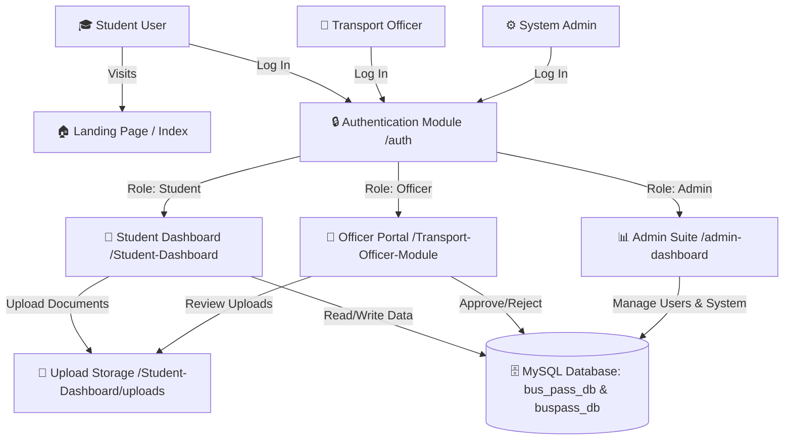
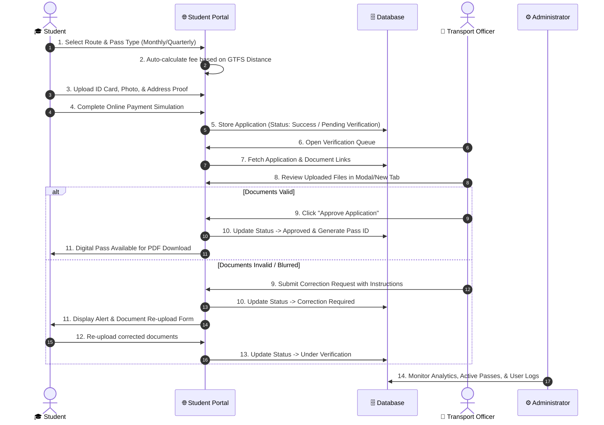
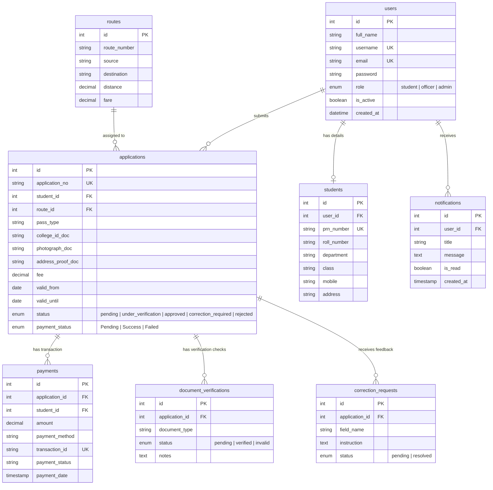

# 🚌 Student Bus Pass Management System (PMPML)

<div align="center">


<p align="center">
  <b>A Smart, Automated, Paperless Transportation & Bus Pass Management Platform</b>
</p>

[Key Features](#-key-features) • [System Architecture](#-system-architecture) • [Database ERD](#-database-entity-relationship-diagram) • [Module Breakdown](#-module-deep-dive) • [Installation Guide](#-installation--setup-guide)

</div>

---

## 📖 System Overview

The **Student Bus Pass Management System** is a full-stack web application designed for educational institutions and municipal transit authorities (e.g., PMPML). It replaces slow, manual paper-based bus pass applications with an instant, secure, online portal. 

Students can calculate fare distances based on GTFS routes, submit verification documents, pay online, and receive digital passes. Transport Officers can verify documents, request corrections, and issue digital passes, while Administrators manage system health, user roles, and global notifications.

---

## 🎨 Visual System Architecture

### 1. High-Level System Architecture



---

### 2. End-to-End Pass Application & Approval Lifecycle



---

## 🗄️ Database Entity-Relationship Diagram



---

## 📁 Repository Structure

```
c:\xampp\htdocs\test2_final\
│
├── 📄 index.php                   # Public Landing Page & Portal Entry Point
├── 📄 styles.css                  # Main Landing Page Stylesheet
├── 📄 script.js                   # Public Interactions & Smooth Scroll
├── 🖼️ hero-bus.png                # Hero Banner Illustration
├── 📄 setup_db.php                # Master Automated DB Installer & Seeder
├── 📄 README.md                   # System Documentation
│
├── 📁 auth/                       # Central Authentication Module
│   ├── 📄 login.php               # Multi-Role Unified Login Screen
│   ├── 📄 logout.php              # Session Destruction & Flash Handler
│   ├── 📄 register.php            # Student Self-Registration
│   ├── 📄 forgot_password.php     # Password Reset Request Form
│   ├── 📄 reset_password.php      # Password Reset Handler
│   ├── 📁 config/                 # DB Connection & Session Bootstrapper
│   └── 📁 includes/               # Shared Header/Footer & CSRF Utilities
│
├── 📁 Student-Dashboard/          # Student Self-Service Portal
│   ├── 📄 dashboard.php           # Student Overview & Active Pass Status
│   ├── 📄 apply_pass.php          # New Pass Application & File Upload Form
│   ├── 📄 renew_pass.php          # Pass Renewal & Extension Engine
│   ├── 📄 my_applications.php     # Application Status & Correction Resolution
│   ├── 📄 download_pass.php       # Printable Digital Bus Pass Generation
│   ├── 📄 generate_receipt.php    # Official Payment Receipt HTML/Print
│   ├── 📄 profile.php             # Student Profile & Avatar Management
│   ├── 📄 notifications.php       # Student Notification Center
│   └── 📁 uploads/                # Secured Storage for Uploaded Documents
│
├── 📁 Transport-Officer-Module/   # Officer Application Review & Approvals
│   ├── 📄 officer_dashboard.php   # Verification Queue Summary & Metrics
│   ├── 📄 verify_application.php  # Detailed Document Inspector & Approval Modal
│   ├── 📄 route_management.php    # Add/Update Bus Routes, Distances & Fares
│   ├── 📄 reports.php             # Export Passes & Verification Analytics (CSV/PDF)
│   ├── 📄 notifications.php       # Officer Alert & Task Feed
│   └── 📄 profile.php             # Officer Credentials Management
│
├── 📁 admin-dashboard/            # System Administrator Suite
│   ├── 📄 index.php               # System Health & Master Analytics
│   ├── 📄 users.php               # Manage Admin, Officer, & Student Accounts
│   ├── 📄 students.php            # Master Student Database Directory
│   ├── 📄 route_management.php    # Global Route Overrides & Fare Tables
│   ├── 📄 reports.php             # System Audit & Revenue Export Tools
│   ├── 📄 notifications.php       # Admin Alert Management Center
│   └── 📁 includes/               # Sidebar & Topbar Components
│
└── 📁 database-design/            # SQL Schemas & Initial Seeding Scripts
    └── 📁 database/               # Relational Schema Definitions (.sql)
```

---

## 🔍 Module Deep Dive

### 🎓 1. Student Dashboard Module (`/Student-Dashboard`)
- **Distance-Based Fare Engine**: Automatically calculates pass fees based on route length in km via GTFS integration.
- **Document Management**: File upload system for College ID, Passport Photo, and Address Proof (JPEG, PNG, PDF).
- **Instant Digital Pass**: Upon approval, generates a clean printable pass featuring student details, valid dates, and verification status.
- **Correction Resolution**: If an officer flags a document, students receive a clear notification with instructions to re-upload without starting over.

### 👮 2. Transport Officer Module (`/Transport-Officer-Module`)
- **Document Inspection**: Direct link to view uploaded student credentials in high resolution.
- **Granular Approvals**: Flag specific documents (e.g. blurred photo) or approve the entire application in one click.
- **Route & Stop Controller**: Define origin, destination, standard fares, and distance matrix.
- **Export Engine**: Export daily approved pass lists and route distribution metrics.

### ⚙️ 3. Admin Dashboard Suite (`/admin-dashboard`)
- **Master User Governance**: Create, edit, activate, or suspend Officer and Student accounts.
- **Global System Feed**: Real-time notifications for system alerts, pending queues, and security events.
- **Financial & Activity Reports**: Track total revenue generated, total active passes, and branch-wise pass adoption.

---

## ⚡ Installation & Local Setup Guide

### 📋 Prerequisites
- **XAMPP Server** (PHP 8.0 or higher, MySQL 8.0+, Apache Enabled)
- Web Browser (Chrome, Firefox, Edge)

---

### 🚀 Step-by-Step Installation

1. **Clone or Copy Repository**:
   Place the project folder in your XAMPP `htdocs` directory:
   ```bash
   C:\xampp\htdocs\test2_final
   ```

2. **Start Apache & MySQL**:
   Open XAMPP Control Panel and start both **Apache** and **MySQL** services.

3. **Automated One-Click Database Setup**:
   Navigate to the automated setup script in your browser:
   ```http
   http://localhost/test2_final/setup_db.php
   ```
   Click **"Start Automated Installation"**. This will:
   - Create `bus_pass_db` and `buspass_db`.
   - Run schema migrations and seed initial default accounts.
   - Configure all required relational keys and indices automatically.

4. **Access the Application**:
   Open the home page:
   ```http
   http://localhost/test2_final/
   ```

---

## 🔑 Default Login Credentials

| Role | Username | Email | Password | Access Portal |
| :--- | :--- | :--- | :--- | :--- |
| **System Administrator** | `admin` | `admin@buspass.local` | `Admin@123` | [Admin Portal](http://localhost/test2_final/admin-dashboard/index.php) |
| **Transport Officer** | `officer` | `officer@buspass.local` | `Admin@123` | [Officer Portal](http://localhost/test2_final/Transport-Officer-Module/officer_dashboard.php) |
| **Student** | `student` | `student@buspass.local` | `Admin@123` | [Student Dashboard](http://localhost/test2_final/Student-Dashboard/dashboard.php) |

---

## 🛡️ Security Features

- **Password Hashing**: Uses PHP `password_hash()` with strong `bcrypt` algorithms.
- **Prepared Statements**: All database operations use `PDO` and `mysqli` prepared statements to eliminate SQL Injection risks.
- **CSRF Tokens**: Form submissions validate unique session-based CSRF tokens.
- **File Upload Sanitization**: Strict file extension and MIME-type validation for document uploads.

---

<div align="center">
  <sub>Built for PMPML Student Transit Management • Paperless & Efficient Solution</sub>
</div>
